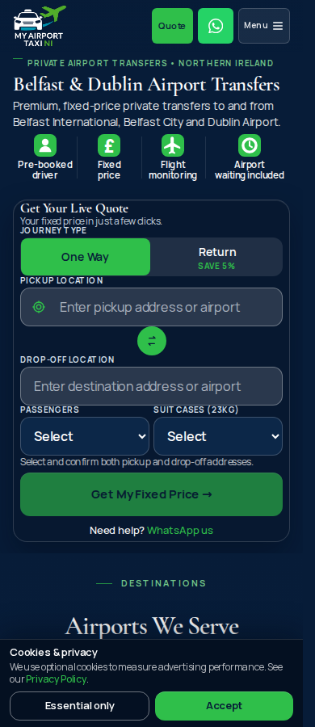
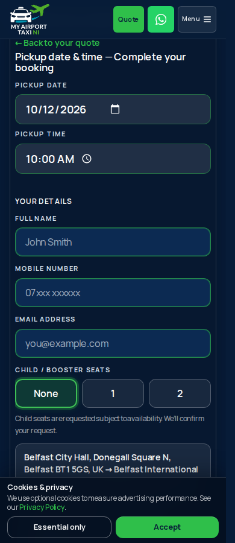
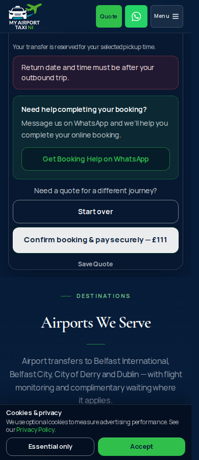

# PR 594 review evidence

The homepage now requires explicit passenger/luggage choices and distinct confirmed addresses before requesting a quote. Pickup and return schedules remain booking requirements. Book This Transfer scrolls to the visible pickup schedule at the start of booking, before contact fields.

5+ uses the existing numeric selector token with suitcasesExact:false. It is not an exact five-bag declaration. The new homepage-only confirmation requires the customer to attest that My Airport Taxi NI has confirmed space for all passengers and luggage. Existing vehicle suitability, availability, fares, processing and SumUp logic are unchanged.

Browser evidence: Chromium, 390×900 mobile and 1280×900 desktop, against the production static export. External services are intercepted, and payment/booking writes are blocked. Screenshots show the actual app.

Local checks passed:
- npx tsc --noEmit
- GITHUB_PAGES=true npm run build
- check-public-minibus-capacity.ts
- check-minibus-availability.ts
- check-luggage-capacity-confirmation.ts (unchanged shared/backend behaviour)
- check-quote-required-fields.ts
- check-book-quote-mobile.ts
- check-quote-reveal-scroll.ts
- check-business-class-dublin-page.ts

Capacity boundaries: Saloon and Business Class support 1–4 passengers and up to 2 standard suitcases; Estate supports 1–4 passengers and up to 4; enabled 7-Seater supports the existing 1–7/5+ selector rules. Larger car parties/luggage are rejected or use the available 7-Seater under existing rules. Disabled 7-Seater prevents >4 passenger / 5+ requests while keeping all requested dropdown options visible.

Live preview desktop verification also confirmed:
- Empty pickup date and time allow a fresh provisional quote.
- Estate selection, both addresses, party/luggage and previously entered contacts survive quote → booking → back.
- Settled pickup date top 217px; fixed header bottom 141px.

Pre-existing test limitation: check-quote-checkout-page.ts fails on unchanged main at its obsolete airportAccessChargeGbp: expressSelection.feeGbp source assertion; current main uses airportAccessQuote.airportAccessChargeGbp. It is not changed in this PR.

Review protection while awaiting review: draft PR; auto_merge:null; repository allow_auto_merge:false. Existing Auto-merge Cursor PRs workflow only applies to cursor/ branches, and skips this codex/ branch. The user subsequently authorized merging when green; no separate production deployment will be initiated.

Browser run: https://github.com/cgr28-commits/reimagined-octo-meme/actions/runs/38068901353 — production build and all 14 browser checks passed at 3923e2575da63f514586481eb9d3c96e1879fe78.

